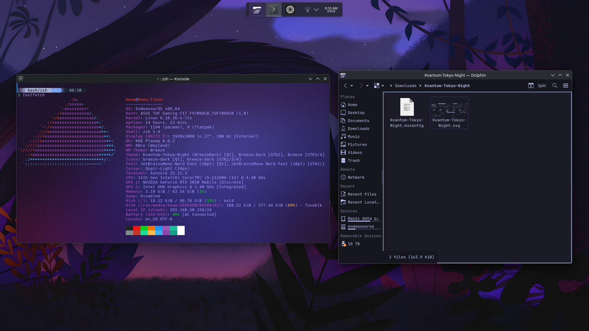

# Dotfiles for my first rice, dark purple/twilight/tokyo night.

# Install instructions (KDE&ARCH ONLY): 
*install kvantum*

```sudo pacman -S kvantum```
Open kvantum and install the "kvantum-theme" theme folder

*install wallpaper*

Navigate to the folder with wallpaper.jpg from this repo
```plasma-apply-wallpaperimage ./wallpaper.jpg```
# Konsole tweaks
System settings -> Window management -> Desktop effects:

Enable blur

Adjust settings:

*Misty (used in unixporn screenshot):* 

Defaults + Turn noise all the way down

*Glass:* 

Blur: none 

Noise: none 

Saturation: none

*Frosted Glass:* 

Blur: none 

Noise: Adjust to liking 

Saturation: none

*Now, Open konsole*

right click -> Edit current profile/Create new profile

Set "Command" to /usr/bin/zsh (For later)

Appearance -> Edit

Foreground color: #a29bff  Foreground intense color: #7c77ff Foreground faint color: #b8bdff

OK, OK (DO NOT CLOSE KONSOLE)

Cool looking terminal prompt: Run cool_prompt.sh
# Stars greatly appreciated!
